 

<h1>Hi, I'm Vaachi Gupta </h1>

 

I’m a Computer Science Engineering student interested in data, machine learning, and building practical software. I enjoy turning complex problems into useful solutions, whether that means working with data, developing ML systems, or building products from the ground up.

 

## Tech Stack

**Languages**

**ML & Data**

**Web & Tools**

## Projects

| Project | Description | Tech |
|---|---|---|
| **Financial Market Risk Analysis** | Entropy-augmented volatility model on 20 years of price data across 224 NSE 500 stocks | Python, GARCH, NumPy/SciPy |
| **GenPlus** — Genetic Disorder Prediction | 77% accuracy on a 22,000-record clinical dataset; FastAPI backend + Next.js frontend for real-time predictions | Python, XGBoost, FastAPI, Next.js |
| **Medisage** — AI Prescription Decoder | OCR + NLP pipeline reading handwritten prescriptions into structured medicine data | Python, FastAPI, OpenCV, EasyOCR |
| **QuizCraft** | Cross-platform React Native flashcard app with AI-generated Q&A via Groq's LLaMA-3 | React Native, Groq API |
| **Wandernest** | Responsive travel journaling app with photo upload & local persistence | HTML5, CSS3, JavaScript |

 

## LeetCode

 

## GitHub

